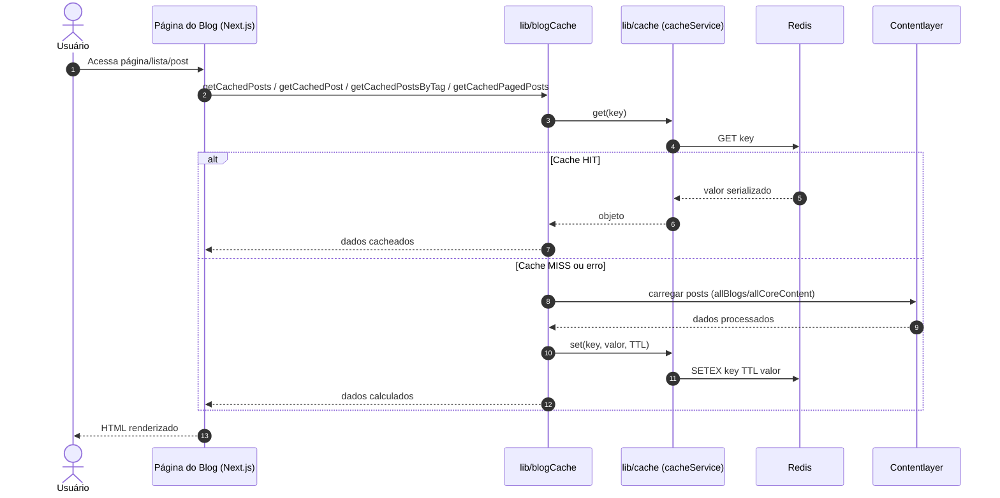
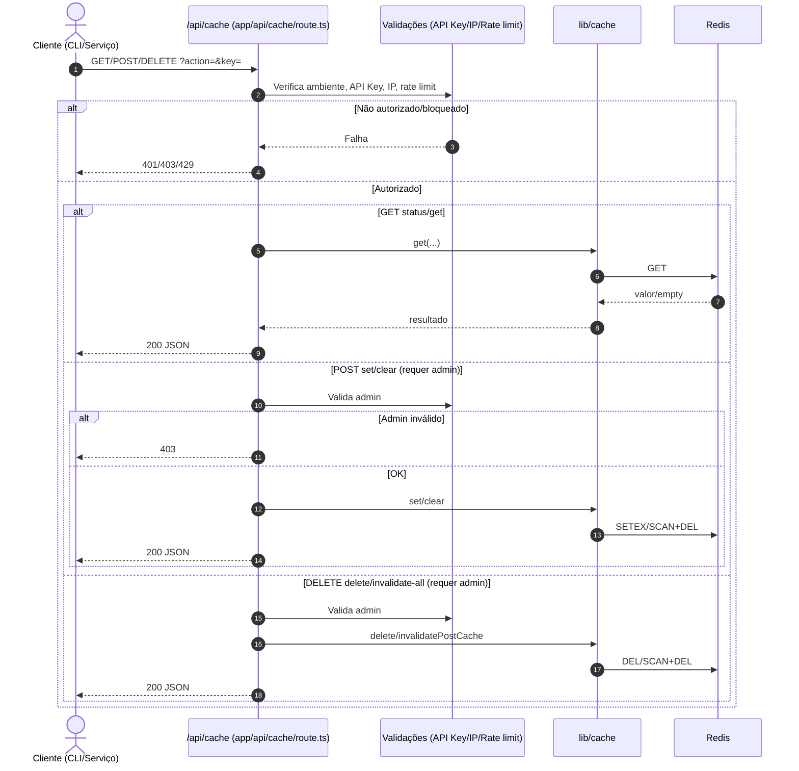

# nataliagranato.github.io

[](https://vercel.com/new/git/external?repository-url=https://github.com/timlrx/tailwind-nextjs-starter-blog)

Este é um template inicial de blog usando [Next.js](https://nextjs.org/) e [Tailwind CSS](https://tailwindcss.com/). A versão 2 é baseada no diretório App do Next.js com [Componentes de Servidor do React](https://nextjs.org/docs/getting-started/react-essentials#server-components) e utiliza o [Contentlayer](https://www.contentlayer.dev/) para gerenciar conteúdo em markdown.

Site pessoal e blog de Natália Granato, focado em tecnologias Cloud Native, containers, Infraestrutura como Código, Observabilidade, DevSecOps e temas relacionados à CNCF.

---

## Sobre o Projeto

Este projeto utiliza [Next.js](https://nextjs.org/), [Tailwind CSS](https://tailwindcss.com/), [Contentlayer](https://www.contentlayer.dev/) e integra um sistema avançado de cache com Redis e monitoramento completo com Sentry, proporcionando uma experiência otimizada e observabilidade em produção.

**Principais tecnologias:**
- **Performance**: Cache Redis acelera a renderização dos artigos do blog, filtragens por tag e paginação
- **Observabilidade**: Sentry para monitoramento de erros, logging e feedback de usuários
- **Infraestrutura**: Deploy otimizado para Vercel com source maps e configurações de produção

Principais temas abordados:
- Cloud Native, Kubernetes, Docker, Observabilidade, DevOps, DevSecOps, automações, ferramentas CNCF.

---

## Instalação e Uso Local

**Pré-requisitos:**
- Node.js 22.x ou superior
- Redis em execução local ou remoto (opcional, mas recomendado para testar o cache)
- npm (Yarn não é mais suportado)

**Clone o repositório:**
```bash
git clone https://github.com/nataliagranato/nataliagranato.github.io.git
cd nataliagranato.github.io
```

**Instale as dependências:**
```bash
npm install
```

**Configuração de ambiente:**
- Copie o arquivo `.env.example` para `.env` e configure as variáveis de ambiente conforme necessário:
  - **Redis**: Credenciais para o sistema de cache (opcional para desenvolvimento)
  - **Sentry**: DSN, organização e projeto para monitoramento de erros
  - **API Keys**: Chaves para autenticação da API de cache
- Para testar funcionalidades do cache, é recomendável rodar um servidor Redis local (`docker run -p 6379:6379 redis`).
- Para testar o Sentry, configure o DSN e habilite a página de teste com `NEXT_PUBLIC_ENABLE_SENTRY_TEST_PAGE=true`.

**Inicie o servidor de desenvolvimento:**
```bash
npm run dev
```

Abra [http://localhost:3000](http://localhost:3000) no navegador.

---

## Principais Funcionalidades

### 🚀 Sistema de Cache com Redis
- Integração de cache Redis para o blog: acelera listagem, busca por tags, paginação e exibição de posts.
- API REST para gerenciamento do cache (`/api/cache`) com autenticação por chave, restrição de IP e rate limiting.
- Scripts de teste para validação automática do cache e da conexão Redis.
- Documentação detalhada para uso da API e do sistema de cache.

### 🔍 Monitoramento e Observabilidade com Sentry
- **Monitoramento de Erros**: Captura automática de erros JavaScript/TypeScript no frontend e backend
- **Logging Avançado**: Integração com console.log, console.warn, console.error para envio automático ao Sentry
- **Performance Monitoring**: Rastreamento de performance com sampling configurável por ambiente
- **User Feedback**: Widget integrado para coleta de feedback dos usuários
- **Source Maps**: Upload automático de source maps para debugging em produção
- **Configuração Multi-Runtime**: Suporte para Server, Client e Edge runtimes do Next.js
- **Controle por Ambiente**: Configuração flexível via variáveis de ambiente para desenvolvimento/produção

#### Variáveis de Ambiente do Sentry
```bash
# Configuração básica
SENTRY_DSN=seu_dsn_aqui
NEXT_PUBLIC_SENTRY_ORG=sua_organizacao
NEXT_PUBLIC_SENTRY_PROJECT=seu_projeto

# Controles de produção
SENTRY_TRACES_SAMPLE_RATE=0.05          # Taxa de sampling (5% em prod)
SENTRY_ENABLE_LOGS=true                  # Habilitar logs (padrão: true)
NEXT_PUBLIC_ENABLE_SENTRY_TEST_PAGE=false # Página de teste (padrão: false)

# Upload de source maps
SENTRY_ORG=sua_organizacao
SENTRY_PROJECT=seu_projeto
SENTRY_AUTH_TOKEN=seu_token_de_auth
```

#### Página de Teste do Sentry
- Acessível em `/test-sentry` (apenas quando `NEXT_PUBLIC_ENABLE_SENTRY_TEST_PAGE=true`)
- Interface para testar: geração de erros, logs console, Sentry.logger e feedback de usuário
- Protegida em produção (retorna 404 por padrão)
- Metadata com `robots: noindex` para evitar indexação

---

## Diagramas de Sequência

### Renderização/Cache de Posts do Blog


```mermaid
sequenceDiagram
  autonumber
  actor User as Usuário
  participant Page as Página do Blog (Next.js)
  participant BlogCache as lib/blogCache
  participant CacheSvc as lib/cache (cacheService)
  participant Redis as Redis
  participant CL as Contentlayer

  User->>Page: Acessa página/lista/post
  Page->>BlogCache: getCachedPosts / getCachedPost / getCachedPostsByTag / getCachedPagedPosts
  BlogCache->>CacheSvc: get(key)
  CacheSvc->>Redis: GET key
  alt Cache HIT
    Redis-->>CacheSvc: valor serializado
    CacheSvc-->>BlogCache: objeto
    BlogCache-->>Page: dados cacheados
  else Cache MISS ou erro
    BlogCache->>CL: carregar posts (allBlogs/allCoreContent)
    CL-->>BlogCache: dados processados
    BlogCache->>CacheSvc: set(key, valor, TTL)
    CacheSvc->>Redis: SETEX key TTL valor
    BlogCache-->>Page: dados calculados
  end
  Page-->>User: HTML renderizado
```

### API de Cache


```mermaid
sequenceDiagram
  autonumber
  actor Client as Cliente (CLI/Serviço)
  participant Route as /api/cache (app/api/cache/route.ts)
  participant Sec as Validações (API Key/IP/Rate limit)
  participant CacheSvc as lib/cache
  participant Redis as Redis

  Client->>Route: GET/POST/DELETE ?action=&key=
  Route->>Sec: Verifica ambiente, API Key, IP, rate limit
  alt Não autorizado/bloqueado
    Sec-->>Route: Falha
    Route-->>Client: 401/403/429
  else Autorizado
    alt GET status/get
      Route->>CacheSvc: get(...)
      CacheSvc->>Redis: GET
      Redis-->>CacheSvc: valor/empty
      CacheSvc-->>Route: resultado
      Route-->>Client: 200 JSON
    else POST set/clear (requer admin)
      Route->>Sec: Valida admin
      alt Admin inválido
        Route-->>Client: 403
      else OK
        Route->>CacheSvc: set/clear
        CacheSvc->>Redis: SETEX/SCAN+DEL
        Route-->>Client: 200 JSON
      end
    else DELETE delete/invalidate-all (requer admin)
      Route->>Sec: Valida admin
      Route->>CacheSvc: delete/invalidatePostCache
      CacheSvc->>Redis: DEL/SCAN+DEL
      Route-->>Client: 200 JSON
    end
  end
```

---

## Customização

- Editar o layout em `app/` ou o conteúdo em `data/`.
- Posts e artigos em `data/blog/`.
- Informações de autor em `data/authors/default.mdx`.
- Configurações de projetos em `data/projectsData.ts`.
- Links de navegação em `data/headerNavLinks.ts`.
- Favicons/imagens em `public/static/`.
- Configuração do cache e API em `.env`.

---

## Documentação

- **docs/CACHE_API.md**: Como usar a API de cache, autenticação e variáveis de ambiente.
- **docs/REDIS_CACHE.md**: Como funciona a integração com Redis, comandos de teste e configuração.
- **docs/SENTRY_CONFIG.md**: Configuração completa do Sentry, monitoramento de erros, logging e feedback de usuários.

---

## Deploy

Este projeto está pronto para deploy no [Vercel](https://vercel.com) e pode ser facilmente integrado a ambientes cloud-native.
